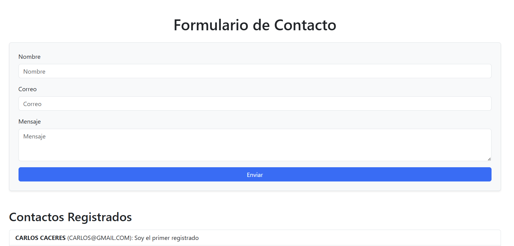

# 📬 Fullstack Contact Form

Este proyecto es una aplicación web **Full Stack** que permite a los usuarios enviar un formulario de contacto y visualizar los mensajes enviados en la misma página. Está construido con **React.js** para el frontend, **Node.js + Express** para el backend, y **PostgreSQL** como base de datos.

---

## 🚀 Tecnologías utilizadas

- ⚛️ **React.js** — Interfaz de usuario (Frontend)
- 🌐 **Node.js + Express** — API REST (Backend)
- 🐘 **PostgreSQL** — Base de datos relacional
- 📡 **Axios** — Cliente HTTP para conectar frontend y backend
- 🎨 **Bootstrap** — Estilizado rápido y responsivo

---

## ⚙️ Instalación y ejecución

### 🔹 Clonar el repositorio

```bash
git clone https://github.com/tu-usuario/fullstack-contact-form.git
cd fullstack-contact-form
```

### 🔹 Configuración de la base de datos

1. Asegúrate de tener **PostgreSQL** instalado y en ejecución.
2. Crea una base de datos llamada `formulario_db`.
3. Ejecuta esta consulta SQL para crear la tabla:

```sql
CREATE TABLE contacts (
  id SERIAL PRIMARY KEY,
  name TEXT,
  email TEXT,
  message TEXT
);
```

---

### 🔹 Ejecutar el backend

```bash
cd backend
npm install
node index.js
```

> El backend se ejecutará en: `http://localhost:5000`

---

### 🔹 Ejecutar el frontend

En otra terminal:

```bash
cd frontend
npm install
npm start
```

> El frontend se abrirá en: `http://localhost:3000`

---

## ✨ Funcionalidades

- Enviar datos desde un formulario web
- Guardar información en PostgreSQL
- Mostrar los mensajes enviados en la misma página
- Estilización moderna con Bootstrap

---

## 📸 Captura de pantalla (opcional)



---

## 📁 Estructura del proyecto

```
fullstack-contact-form/
├── backend/
│   ├── db.js
│   ├── index.js
│   └── package.json
├── frontend/
│   ├── src/
│   │   ├── App.js
│   │   └── index.js
│   └── package.json
└── README.md
```

---

## 🧠 Autor

**Karen Mendoza**  
💼 Desarrolladora Front-End Jr.  
🚀 En formación a través de proyectos Full Stack prácticos

---

## 📝 Licencia

Este proyecto se comparte con fines educativos y personales.  
¡Siéntete libre de usarlo, mejorarlo y compartirlo!
